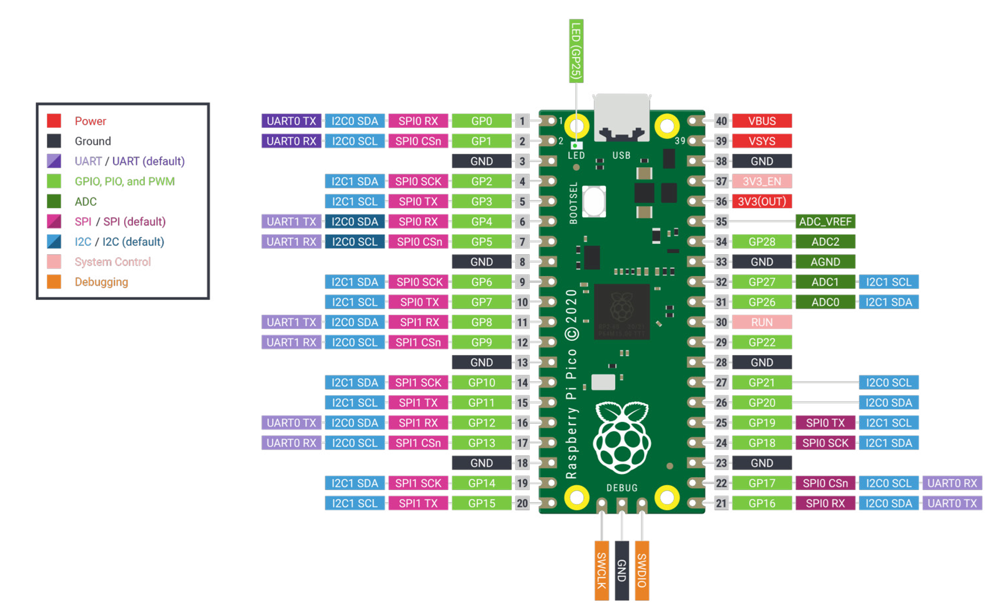
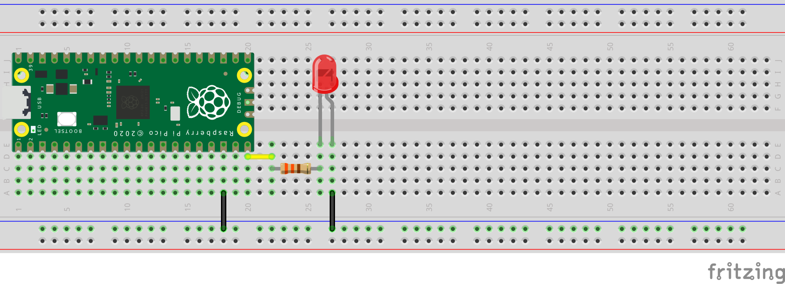
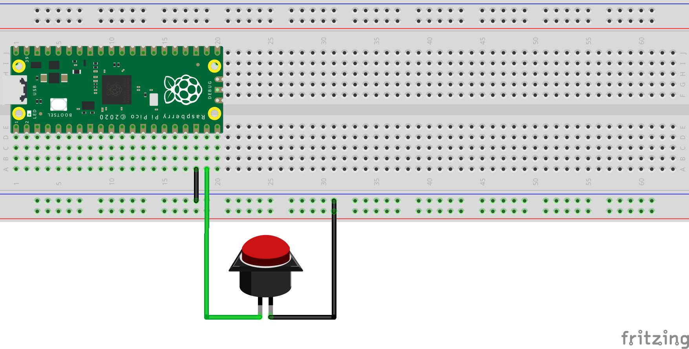
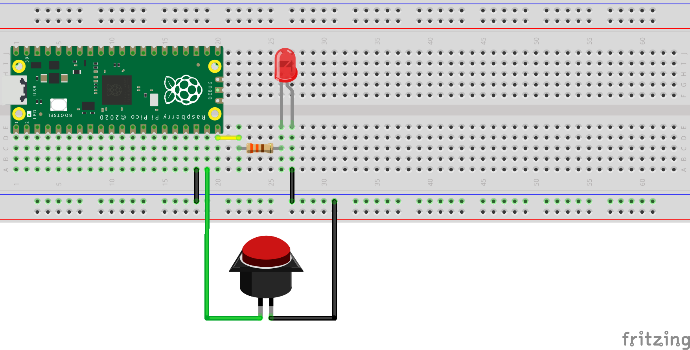

# บทที่ 11 การใช้งาน Digital I/O ด้วย Raspberry Pi Pico

บทนี้เป็นการเริ่มต้นใช้งานขา GPIO ของ Raspberry Pi Pico  
โดยใช้ **Digital Input / Digital Output**

---

## 11.1 Digital I/O คืออะไร

Digital I/O คือสัญญาณที่มีเพียง 2 สถานะ

- `0` (LOW) = ปิด
- `1` (HIGH) = เปิด

ตัวอย่างอุปกรณ์ Digital I/O:
- LED
- ปุ่มกด (Button)
- Relay
- Buzzer

---

## 11.2 การใช้งาน GPIO เป็น Output (LED)

### อุปกรณ์ที่ใช้
- Raspberry Pi Pico
- Breadboard
- LED
- ตัวต้านทาน 330Ω
- สาย Jumper

### การต่อวงจร

## แผนผังการต่อสาย (Diagram)


- GPIO15 → ตัวต้านทาน 330Ω → ขา + ของ LED
- ขา – ของ LED → GND

> หมายเหตุ: ต้องใส่ตัวต้านทานทุกครั้ง เพื่อป้องกัน LED เสียหาย

### โปรแกรมควบคุม LED

```python
from machine import Pin
import time

led = Pin(15, Pin.OUT)

while True:
    led.on()
    time.sleep(1)
    led.off()
    time.sleep(1)
```

---

## 11.3 การใช้งาน GPIO เป็น Input (Button)

### อุปกรณ์ที่ใช้
- Raspberry Pi Pico
- Breadboard
- ปุ่มกด (Push Button)
- สาย Jumper

### การต่อวงจร

## แผนผังการต่อสาย (Diagram)


- ขาหนึ่งของปุ่ม → GPIO14
- อีกขาหนึ่งของปุ่ม → GND

ใช้ Pull-up ภายในของ Pico

### โปรแกรมอ่านค่าปุ่ม

```python
from machine import Pin
import time

button = Pin(14, Pin.IN, Pin.PULL_UP)

while True:
    if button.value() == 0:
        print("กดปุ่ม")
    else:
        print("ยังไม่กดปุ่ม")
    time.sleep(0.3)
```

### การทำงาน
- ไม่กดปุ่ม → ค่า = 1
- กดปุ่ม → ค่า = 0

---

## 11.4 ตัวอย่าง Button ควบคุม LED
### การต่อวงจร

## แผนผังการต่อสาย (Diagram)


### โปรแกรม

```python
from machine import Pin

led = Pin(15, Pin.OUT)
button = Pin(14, Pin.IN, Pin.PULL_UP)

while True:
    if button.value() == 0:
        led.on()
    else:
        led.off()
```

---

## 11.5 สรุปท้ายบท

นักเรียนได้เรียนรู้:
- ความหมายของ Digital I/O
- การใช้ GPIO เป็น Output
- การใช้ GPIO เป็น Input
- การควบคุม LED ด้วยปุ่มกด

---

## แบบฝึกหัดท้ายบท

1. เปลี่ยนขา LED จาก GPIO25 เป็น GPIO15
2. ปรับเวลาเปิด–ปิด LED ให้เร็วขึ้น
3. ทำให้ LED ติดเฉพาะตอนกดปุ่ม
